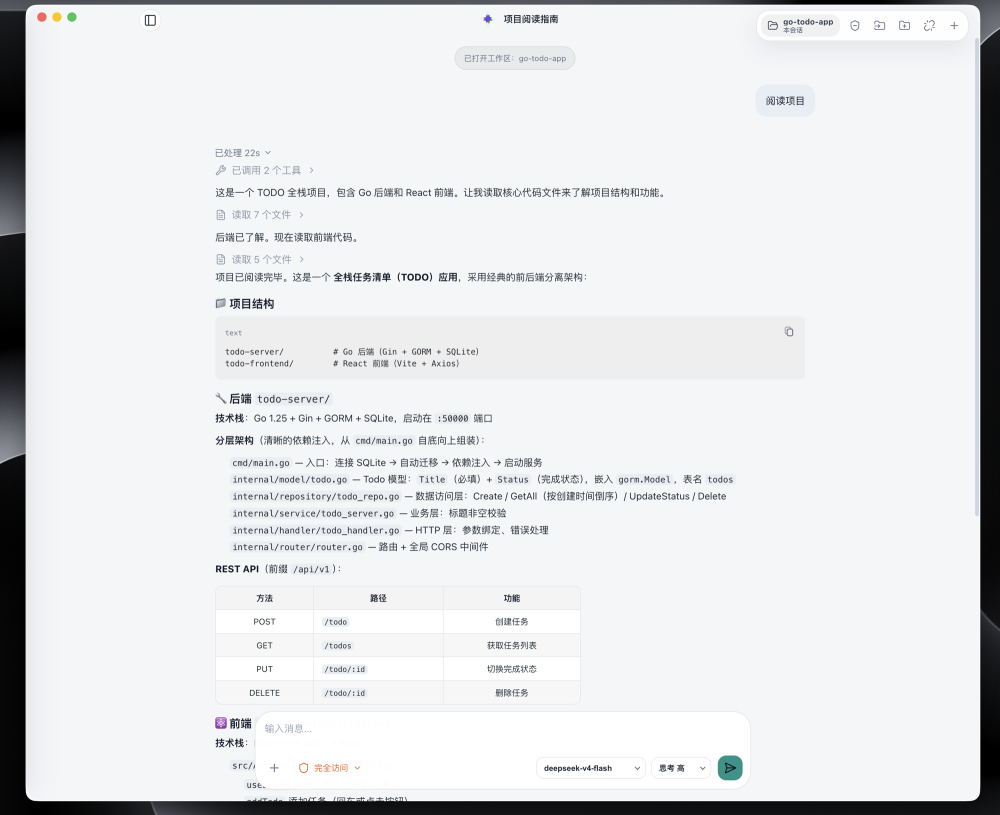
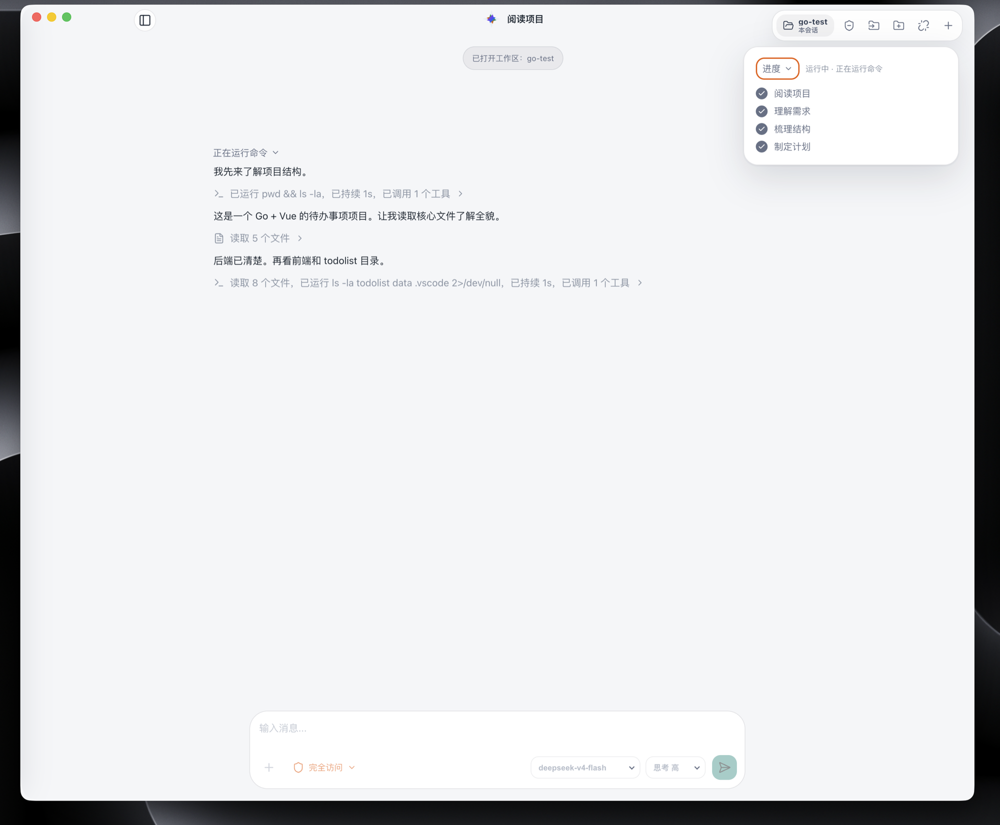
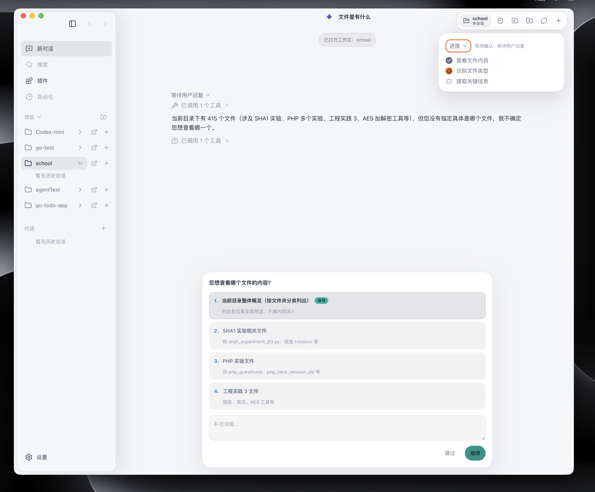
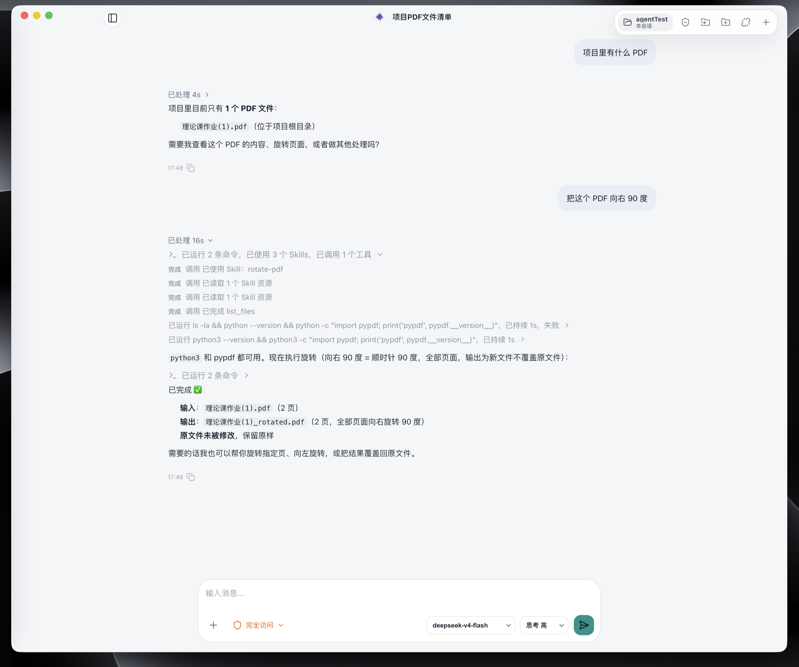

# XCode

XCode 是一个用 Python 构建的 Codex 类本地 Coding Agent。Python Runtime 负责模型循环、工具执行、安全策略、会话恢复和本地数据持久化；Electron + Vue 桌面端负责聊天、审批、Diff Review、任务计划与会话管理。

> 当前状态：Stage 2 Alpha。核心 Runtime 和桌面客户端主链路已经可用，仍处于本地开发与产品化阶段，不建议直接用于无人值守的生产任务。

## 界面演示

### 项目阅读与结构分析



### 实时任务进度



### 交互式澄清



### Skills 扩展能力



## 已实现能力

- **Agent Runtime**：基于 LangGraph 与 LiteLLM 的流式模型循环，支持工具调用、澄清、取消、挂起和恢复。
- **桌面客户端**：Electron + Vue + TypeScript，支持聊天、Markdown、工具时间线、权限确认、历史会话和工作区切换。
- **Workspace 边界**：区分 `selected_root`、`project_root`、`current_dir` 与显式添加的额外目录；恢复会话时重新校验安全边界。
- **权限与沙箱**：提供 `request_approval`、`auto_approve`、`full_access`、`custom` 四种模式；macOS 默认通过 Seatbelt 限制文件和网络访问。
- **安全文件修改**：写入工具默认只生成 Patch Preview，用户可检查 Diff 后应用、拒绝或回滚，并可在应用后运行测试。
- **Git 只读审查**：支持查看状态、变更文件和 Diff，不自动提交、推送或创建 PR。
- **持久会话**：SQLite 索引 + append-only JSONL transcript，支持服务重启后的会话恢复。
- **本地 Skills**：支持 repo/user Skills 的发现、选择、读取、创建、导入、安装、更新和资源管理。
- **Plan Mode**：可先生成待确认计划，确认后再进入正常实现回合。
- **透明 Memory**：支持会话摘要、任务状态、关键词检索和显式偏好记录；当前不会自动把 durable memory 注入模型提示词。
- **受管理后台进程**：通过 Runtime 启动、检查和停止服务进程，限制直接后台化与任意 PID 终止。
- **本地可观测性**：结构化 Runtime 日志记录模型、工具和用户交互，同时过滤凭证、隐藏推理和完整 Skill 内容。

## 环境要求

- macOS（原生 Seatbelt 沙箱目前仅支持 macOS）
- Python 3.11+
- Node.js 20+
- pnpm

非 macOS 环境可以开发和运行部分 Runtime 能力，但不能获得当前同等的命令沙箱保障。

## 快速开始

### 1. 安装 Python 依赖

```bash
make init
```

### 2. 配置模型

```bash
cp .env.example .env
```

至少填写：

```dotenv
API_KEY=your-api-key
MODEL_PROVIDER=deepseek
MODEL_NAME=your-model-id
```

如服务商使用自定义兼容地址，再配置 `API_BASE`。完整可选项和说明见 [`.env.example`](.env.example)。

### 3. 启动 Runtime 服务

```bash
make run-server
```

默认监听 `ws://127.0.0.1:8000/agent/ws`。

### 4. 启动桌面客户端

另开一个终端：

```bash
cd desktop
pnpm install
pnpm run dev
```

桌面端启动后，选择一个本地目录作为工作区即可开始使用。

## CLI 模式

如果只想体验终端 Agent：

```bash
make run
```

CLI 与桌面端共享核心工具和安全策略，但桌面端提供更完整的审批、Patch Review 和会话体验。

## 安全模型

XCode 把用户选择的工作区视为安全边界：

- 默认模式下，修改文件、执行命令和运行测试需要用户批准。
- `write_file` 与 `edit_file` 默认生成待审查 Patch，不直接修改源码。
- `.env` 默认禁止文件工具读取和写入；`.git`、`.codex-mini`、`.venv`、`__pycache__` 等目录禁止写入。
- 命令默认禁止网络访问，额外目录必须由用户显式授权。
- 长期运行的服务应使用受管理进程工具，不能用 `nohup` 或 `&` 绕过 Runtime。
- `full_access` 会关闭 Seatbelt 并允许网络，仅应在明确理解风险时使用。

项目级 `.codex-mini/config.toml` 只有在用户将项目标记为 trusted 后才会加载，并且只接受受限的白名单配置。

## 项目结构

```text
.
├── agent_loop.py       # CLI Agent 入口
├── server/             # WebSocket 协议、请求处理与模型回合 Runtime
├── desktop/            # Electron + Vue 桌面客户端
├── tools/              # 文件、搜索、Shell、Git、Patch、Skills 等工具
├── security/           # 文件系统、权限、命令与网络策略
├── sandbox/            # macOS Seatbelt 执行器
├── workspace/          # 工作区模型、校验、信任与项目配置
├── session/            # SQLite 索引、JSONL transcript 与恢复
├── patch/              # Patch proposal、Diff 与状态存储
├── skills/             # Skills 发现、校验、安装与管理
├── memory/             # Session/Task Memory 与检索
├── processes/          # Runtime 管理的后台进程
├── observability/      # 本地结构化运行日志
├── prompts/            # 模块化系统提示词
└── tests/              # Runtime 单元与集成测试
```

核心边界是：桌面端保持轻量，Python Runtime 统一拥有工具执行、权限判断、会话持久化和恢复能力。

## 开发与验证

运行后端测试：

```bash
.venv/bin/python -m unittest discover -s tests
```

检查 Python 模块是否可编译：

```bash
.venv/bin/python -m compileall agent_loop.py tools security sandbox server session workspace skills patch memory observability processes tests
```

检查桌面端并构建：

```bash
cd desktop
pnpm run typecheck
pnpm run build
```

本地生成数据位于 `.codex-mini/`，其中 sessions、memory、logs、patches 和 task state 都不应提交到 Git。需要清理会话时可显式运行：

```bash
make clean-sessions
```

## 文档

- [当前架构与实现状态](docs/PROJECT_ARCHITECTURE_STATUS.md)
- [产品化路线](docs/PRODUCTIZATION_ROADMAP.md)
- [Workspace 与权限架构](docs/WORKSPACE_PERMISSION_ARCHITECTURE.md)
- [Stage 4 Change Review Runtime](docs/STAGE4_CHANGE_REVIEW_RUNTIME.md)
- [Skills 架构](docs/SKILLS_ARCHITECTURE.md)
- [Skills 快速开始](docs/SKILLS_QUICKSTART.md)
- [Skill 编写指南](docs/SKILL_AUTHORING_GUIDE.md)
- [Runtime 日志说明](docs/RUNTIME_LOGGING.md)

## 当前边界

- 这是本地 Alpha 项目，不是托管服务或最终产品官网。
- Durable Memory 已可管理，但尚未自动注入模型上下文。
- Plan Mode 已支持生成、确认和取消计划，计划编辑与更严格的逐步执行约束仍未产品化。
- Workspace/Permission v2 的核心切片已经落地，项目级策略编辑、跨会话持久 allowlist 和更细粒度网络规则仍在后续范围。
- IDE 扩展尚未实现；未来会复用当前 Runtime 协议，而不是复制工具执行逻辑。
